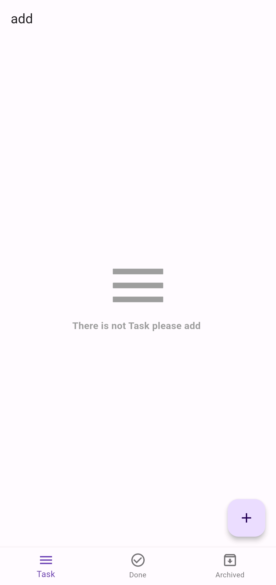
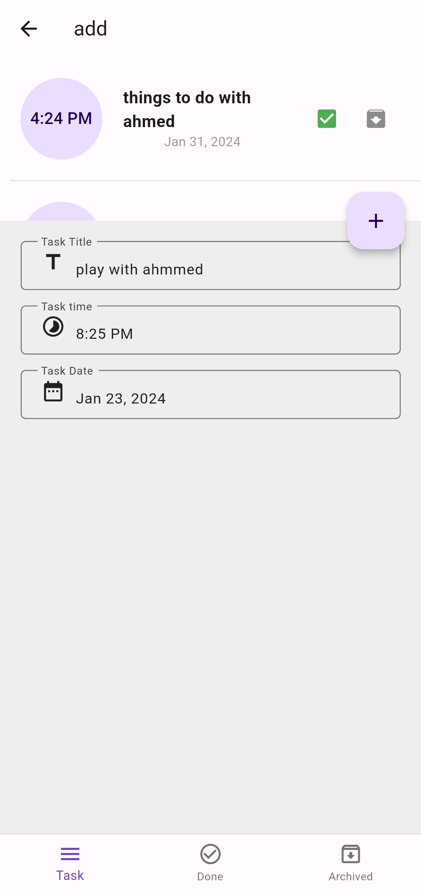
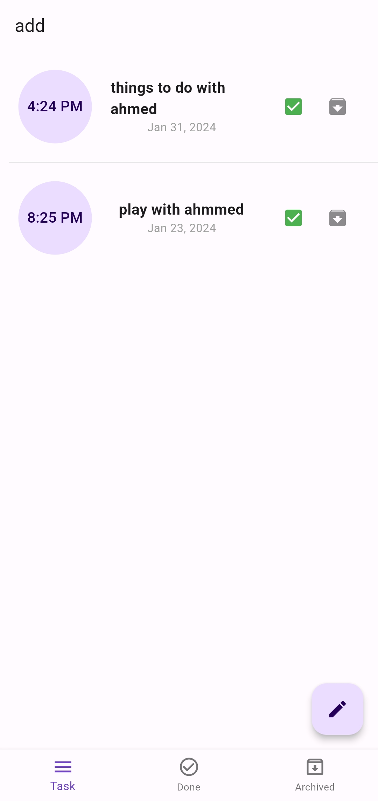

# Simple Task Manager App by Cubit

This is a basic task manager app built using the Bloc state management library in Flutter. The app allows users to add tasks, mark them as completed, and archive completed tasks.

## Features

- **Add Task**: Users can add new tasks to the task list.
- **Complete Task**: Tasks can be marked as completed.
- **Archive Task**: Completed tasks can be archived for future reference.

## Dependencies

- [Flutter](https://flutter.dev/)
- [Bloc](https://pub.dev/packages/flutter_bloc)

## 📸 Screenshots :

